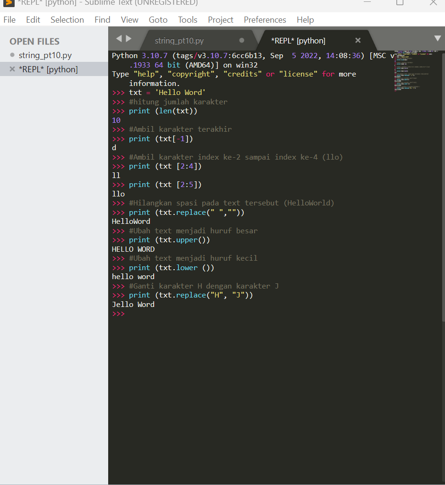
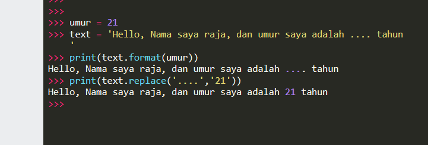

# praktikum10 
## Operasi String Lanjutan

## Latihan 

```
txt = 'Hello word'
```

#### • Hitung jumlah karakternya
#### • Ambil karakter terakhir
#### • Ambil karakter index ke-2 sampai index ke-4 (llo)
#### • Hilangkan spasi pada text tersebut (HelloWorld)
#### • Ubah text menjadi huruf besar
#### • Ubah text menjadi huruf kecil
#### • Ganti karakter H dengan karakter J

gambar 




## latihan 
• Lengkapi kode berikut:

umur = 24
txt = 'Hello, nama saya john, dan umur saya adalah
... tahun'

print(txt.format(umur))

menggunakan :

```
print(text.replace('....','21'))
```
gambar




## sekian terimakasih

```
kind regards

"Raja Happyanto"

```

18-01-2023
